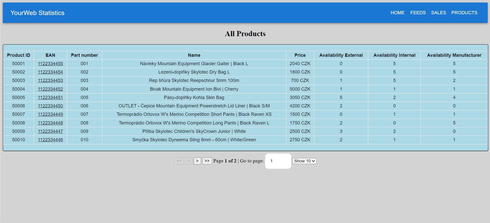

# Statistics Application _StatisticsApp_


### About

StatisticsApp is a comprehensive tool designed to assist online store managers in tracking goods and finances
effectively. It provides essential features for monitoring inventory, analyzing revenue, and adjusting trading
strategies.

### Features

* Inventory Management: Keep track of available items, including details like availability from the manufacturer, price,
  and description.

* Revenue Comparison: Easily compare revenue for specific days to identify trends and make informed decisions.

* Market Analysis: Analyze market dynamics and trends to optimize trading strategies.

* Automated Calculations: Say goodbye to manual calculations! StatisticsApp automates essential tasks, eliminating the
  need for external tools like calculators or spreadsheets.

## Running StatisticsApp locally

StatisticsApp is a [Spring Boot](https://spring.io/guides/gs/spring-boot) application built
using [Maven](https://spring.io/guides/gs/maven/) and [ReactJS](https://legacy.reactjs.org/docs/getting-started.html) with [Vite](https://vitejs.dev/guide/) for frontend. 

_Note: Spring Boot Server App must be running before starting the client!_

You can build a jar file and run it from the command line (it should
work just as well with Java 11 or newer):


```
git clone https://github.com/Lavrek/StatisticsApp.git
cd StatisticsApp
./mvnw package
java -jar target/*.jar
```

You can then access StatisticsApp here: http://localhost:8080/

You can also run it from Maven directly using the Spring Boot Maven plugin. If you do this it will pick up changes that
you make in the project immediately.


After starting the server you can install and run the client:
```
npm install (installs the node modules)
npm run dev
```
Now you can access StatisticsApp web application here: `http://localhost:5173`




## Database configuration

In its default configuration, StatisticsApp uses a MySQL database on the local machine. You can inspect the content of
the database using the following URL: `jdbc:mysql://localhost:3306/statistics`.

Note that whenever the database type is changed, the app needs to be run with a different profile:

`spring.profiles.active=postgres` for PostgreSQL,
`spring.profiles.active=h2` for an in-memory database (H2).

## Working with StatisticsApp in your IDE

#### Prerequisites

* Java 11 or newer.
* git command line tool (https://help.github.com/articles/set-up-git)
* Your preferred IDE

#### Steps:

-- On the command line

```
git clone https://github.com/Lavrek/StatisticsApp.git
```

-- Inside your IDE (for example IntelliJ IDEA)

In the main menu, choose`File -> Open` and select the StatisticsApp [pom.xml](pom.xml). Click on the `Open` button.

-- Visit [http://localhost:8080](http://localhost:8080 "StatisticsApp home") in your browser.

### Tests

StatisticsApp also contains few unit tests for model creation and methods.

developed by Lavrek.